# Documentation Technique - Projet Lutece Starters

## 📋 Table des matières

1. [Vue d'ensemble](#vue-densemble)
2. [Architecture du projet](#architecture-du-projet)
3. [Structure des modules](#structure-des-modules)
4. [Flux de dépendances](#flux-de-dépendances)
5. [Guide d'utilisation](#guide-dutilisation)
6. [Configuration et déploiement](#configuration-et-déploiement)

---

## 🎯 Vue d'ensemble

Le projet **Lutece Starters** est un ensemble de modules Maven pré-configurés permettant de démarrer rapidement des applications basées sur la plateforme Lutece. Il suit le pattern "starter" popularisé par Spring Boot, offrant des configurations prêtes à l'emploi pour différents cas d'usage.

### Objectifs principaux

- **Simplifier** le démarrage de nouveaux projets Lutece
- **Standardiser** les dépendances et configurations
- **Modulariser** les fonctionnalités par domaine métier
- **Centraliser** la gestion des versions

### Technologies utilisées

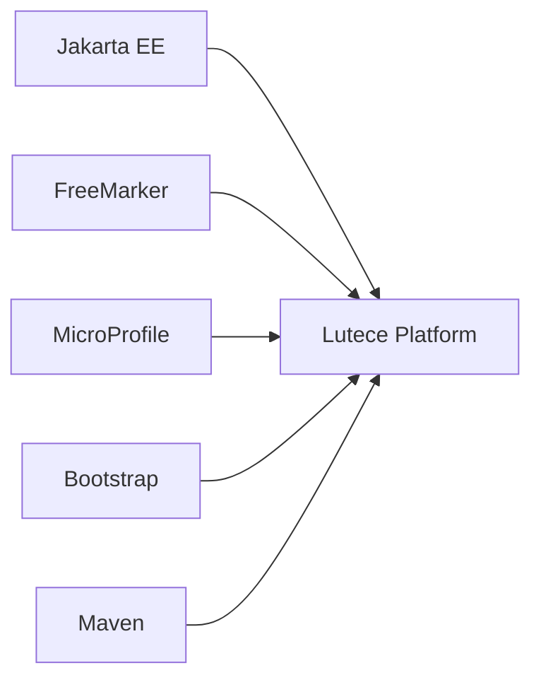

---

## 🏗️ Architecture du projet

### Vue d'ensemble de l'architecture

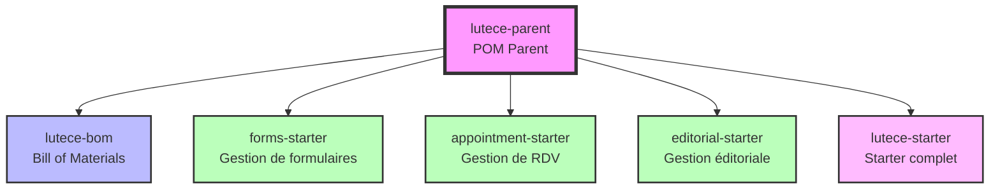

### Hiérarchie Maven

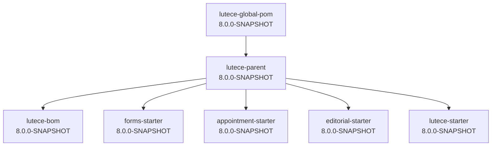

---

## 📦 Structure des modules

### 1. **lutece-bom** (Bill of Materials)

Centralise la gestion des versions pour tout l'écosystème Lutece.

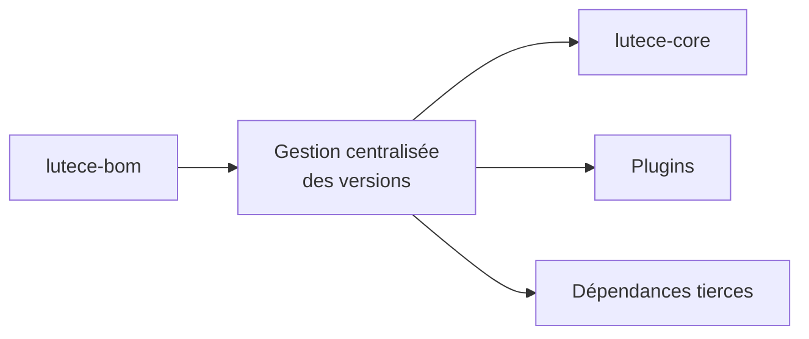

### 2. **forms-starter**

Starter pour la gestion de formulaires dynamiques.

#### Dépendances principales

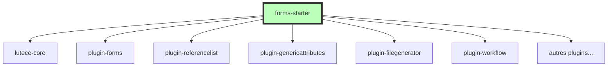

### 3. **appointment-starter**

Starter pour la gestion de rendez-vous.

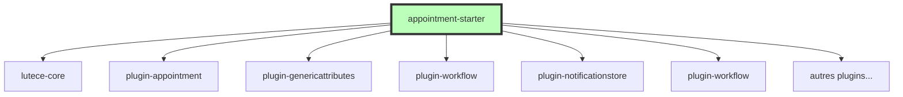

### 4. **editorial-starter**

Starter pour la gestion de contenu éditorial.

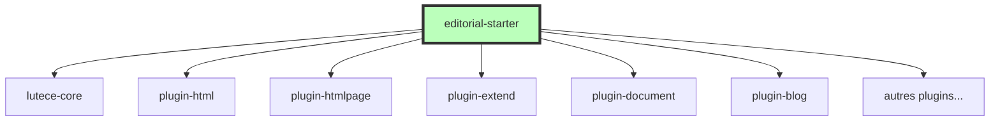

### 5. **lutece-starter**

Starter complet agrégeant tous les autres starters ainsi que d'autres plugins.

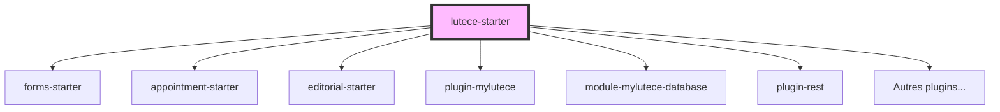

---

## 🔄 Flux de dépendances

### Architecture en couches

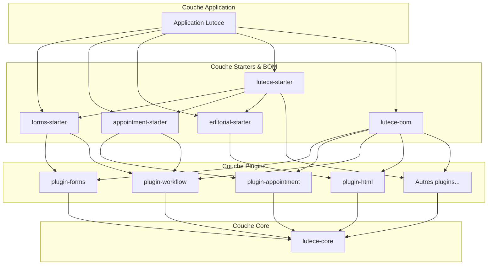
### Lutece palte-form

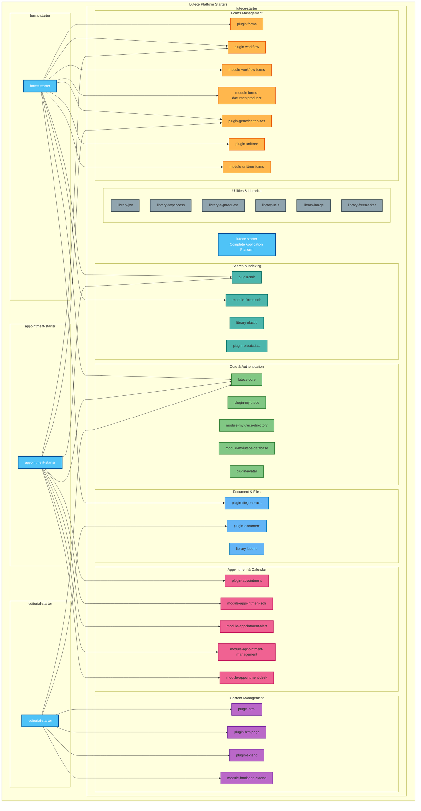
### Gestion des versions

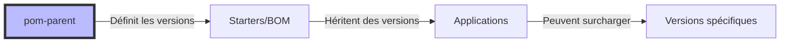

---

## 📘 Guide d'utilisation

### 1. Créer un nouveau projet Lutece

```bash
# Créer le pom du site
pom.xml

# Choisir votre starter
forms-starter  # Pour une application de gestion de formulaire dynamique
ou appointment-starter  # Pour une application de gestion de rdvs
ou  editorial-starter  # Pour une application de gestion de contenu
ou  lutece-starter  # Pour une application complète
ou lutece-bom # Pour choisir les plugins qui vous intéresse
#Builder le site en mode dev pour surcharger le FO
mvn liberty:dev

```

### 2. Configuration Maven

Exemple d'un pom de site forms pour la gestion de formulaires dynamiques.

```xml
<!-- pom.xml de votre application -->
<parent>
        <artifactId>lutece-site-pom</artifactId>
        <groupId>fr.paris.lutece.tools</groupId>
        <version>8.0.0</version>
</parent>
 
 <modelVersion>4.0.0</modelVersion>
 <groupId>fr.paris.lutece</groupId>
 <artifactId>lutece-site-forms</artifactId>
 <packaging>lutece-site</packaging>
 <name>Site Lutece</name>
 <version>1.0.0</version>
 <description></description>
 
<repositories>
       <repository>
           <releases>
               <enabled>true</enabled>
           </releases>
           <snapshots>
               <enabled>false</enabled>
           </snapshots>
           <id>lutece</id>
           <name>luteceRepository</name>
           <url>https://dev.lutece.paris.fr/maven_repository</url>
           <layout>default</layout>
       </repository>
</repositories>
<dependencyManagement>
      <dependencies>
            <!-- Lutece BOM -->
		<dependency>
			<groupId>fr.paris.lutece.starters</groupId>
			<artifactId>lutece-bom</artifactId>
			<version>8.0.0-SNAPSHOT</version>
			<scope>import</scope>
			<type>pom</type>
		</dependency>
	</dependencies>
</dependencyManagement>
<dependencies>
	<dependency>
	    <groupId>fr.paris.lutece.starters</groupId>
	    <artifactId>forms-starter</artifactId>
	    <version>8.0.0-SNAPSHOT</version>
	</dependency>
	<!--Dépendance non importée par le starter forms-starter -->
	<dependency>
	    <groupId>fr.paris.lutece.plugins</groupId>
	    <artifactId>module-mylutece-database</artifactId>
	    <type>lutece-plugin</type>			
	</dependency>
</dependencies>
<properties>
    <!-- Surcharger les versions si nécessaire -->
    <lutece.plugin-forms.version>1.3.2</lutece.plugin-forms.version>
</properties>
```

### 3. Processus de build

## 🚀 Configuration et déploiement

### Workflow de développement

### Architecture de déploiement

## 🚀 Bonnes pratiques

### 1. Choix du starter

| Cas d'usage | Starter recommandé | Plugins inclus |
|-------------|-------------------|----------------|
| Formulaires en ligne | forms-starter | forms, genericattributes, workflow ... |
| Prise de RDV | appointment-starter | appointment, calendar, ... |
| Site éditorial | editorial-starter | html, htmlpage, extend, ... |
| Application complète | lutece-starter | Tous les plugins |

### 2. Gestion des versions

- **Toujours** utiliser le BOM pour la cohérence des versions
- **Surcharger** les versions uniquement si nécessaire
- **Tester** la compatibilité avant mise à jour

### 3. Flux de développement

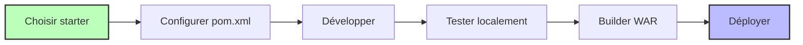

---

## 📝 Conclusion

Le projet Lutece Starters offre une approche moderne et modulaire pour démarrer rapidement des applications Lutece. En suivant les patterns établis et en utilisant les starters appropriés, les équipes de développement peuvent se concentrer sur la logique métier plutôt que sur la configuration technique.

### Points clés à retenir

1. **Modularité** : Choisissez le starter adapté à vos besoins
2. **Standardisation** : Suivez les conventions Lutece
3. **Évolutivité** : Ajoutez des plugins selon les besoins
4. **Maintenabilité** : Utilisez le BOM pour gérer les versions

### Ressources supplémentaires

- [Documentation Lutece officielle](https://lutece.paris.fr)
- [Wiki Architecture](https://dev.lutece.paris.fr/gitlab/archi/comite-achitecture/-/wikis/home)
- [Référentiel des plugins](https://dev.lutece.paris.fr/plugins)
